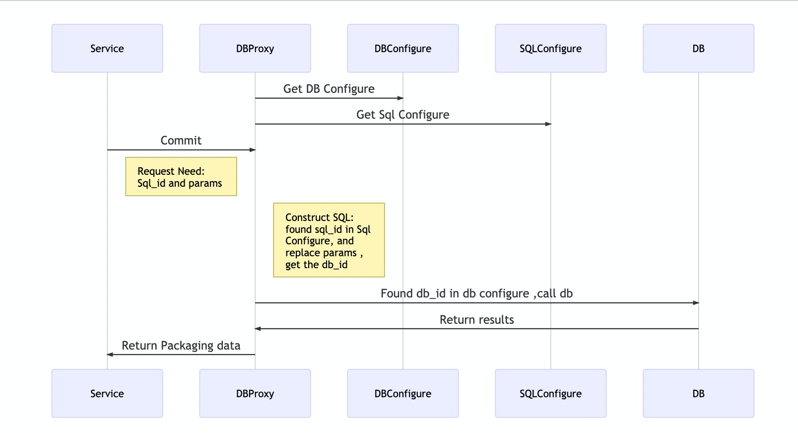

## 简介
从我的上一个GO项目：https://github.com/toniz/gudp 修改过来的。
这是一个数据库访问代理．目前支持mysql. pgsql. 很容易就能添加其它数据源支持.
只需要使用SQLID调用,无需关心数据库连接和查询细节.满足大部分的数据服务需求,并且追求简单,轻量化以及扩展性.使用GO语言编码.

## 特性:
* 使得数据访问统一化
* 链接收敛.业务层几千个数据请求链接,如果直接访问数据库,会造成数据库资源浪费的问题.通过GUDP后,到数据库的链接个数能达到最优利用.
* 努力使其具备更好的扩展性,支持更多的数据源.
* 水平扩容，业务无关。

## 目前有如下优点：
* 简单易用,修改查询逻辑不需要改业务代码或者切换数据库,只需要改动GUDP的SQL配置语句.
* 读写分离
* 安全,业务层不会接触到数据源.通过参数替换达到数据查询效果，屏蔽了注入SQL的途径.
* 支持数据库分片.  
* 支持多数据库事务提交.  


## 数据流图


* 调用方法是: 传递sql_id和参数,参数是一个map.
```
    mds := NewMysqlDataService()
    mds.Cfg.DBPath = "./config/db/"
    mds.Cfg.SqlPath = "./config/sql/"
    err := mds.InitMysqlConnection()
    if err != nil {
        log.Fatalf("Connect To Mysql Failed:", err)
    }

    ident = "t_user_select_by_uid"
    params = map[string]string{
        "limit_start": "100",
        "limit_end": "10"
    }
    res, err := mds.AutoCommit(context.TODO(), ident, params)
    if err != nil {
        log.Printf("Select? From DB Failed: %v", err)
    }
```

* 在./config/sql/目录下找到对应的sql语句:
···
    {
        "ident": "t_user_select_by_uid",
        "sql" : "SELECT user_id, user_name, type FROM t_user WHERE user_id>=$limit_start$ ORDER BY user_id ASC LIMIT $limit_end$ ;",
        "noquote" : {"limit_start":"", "limit_end":""},
        "db" : "db_account_r"
    }
···  

* 在./config/db/目录下找到DB:db_account_r对应的数据库配置：
···
    {
        "ident" : "db_account_r",
        "driver": "mysql",
        "db" : "ibbwhat",
        "user" : "ibbwhat",
        "password" : "123456",
        "endpoint" : "10.107.152.167:3306",
        "encoding" : "utf8,utf8mb4",
        "connection" : {
            "maxcount" : 100,
            "lifetime" : 3600,
            "timeout" : 5
        }
    }
···

* 所以上面的调用如下:
```
Connect To: 127.0.0.1 4000 
Execute This Sql:
SELECT user_id, user_name, type FROM t_user WHERE user_id>=100 ORDER BY user_id ASC LIMIT 10 
And Return Result.
```

### Detail Parameter:
[更详细的配置说明](../doc/mysql_parameter.md).  

## Example:
Mysql Read Write Spilting  
[MYSQL读写分离实现](../doc/mysql_read_write_splitting.md)。 

Mysql Sharding Example  
[MYSQL数据库分片实现](../doc/mysql_db_sharding.md)。 

Mysql Multi DB Transcation  
[MYSQL多数据库事务实现](../doc/mysql_multi_db_transaction.md)。 


### 参考:
[mysql db configure](example/db)

[mysql sql configure](example/sql) 
 
[Test DB Create And Test](dbproxy_test.go)  


### Pgsql
* 使用pgsql只需要修改配置文件即可.

[pgsql db configure](example/db/pg_account.json)

[pgsql sql configure](example/sql/pgsql_account.json)


